## Xodo 5.0.31 backup

Xodo这款桌面 PDF阅读器加载速度快，功能强大，十分优秀，本id重度依赖PDF文件，已用5年有余， 特此备份win10应用商店下载的Xodo 5.0.31的APPX包

## 关于

Xodo 5.0.31 本id感觉是最后一个比较稳定的不闪退版本（与Xodo5.0.28差不多）

目前（2022-11-15）微软应用商店安装的Xodo都是6.0版本后的，存在以下BUG，开发团队迟迟未修复，用起来比较痛苦：

- 闪退/崩溃/卡死的问题，终止程序后，再次打开，程序卡死，只能重装
- 对PDF某一页添加文本框以中文注释时，第一排的字体最上面被吃掉了几个像素，强迫症震怒
- 修改中文文本框字体的大小或颜色，程序极有可能卡死
- 待补充。。。

然而 Xodo 5.0.31 无或极少概率出现以上现象，是十分优秀的一个版本

## 教程

下载本仓库到本地，解压，进入以下目录：

```
xodo_5.0.31_bakup\xodo_5.0.31
```

在想安装本仓库Xodo 5.0.31 的电脑上，双击安装第一个.cer数字证书

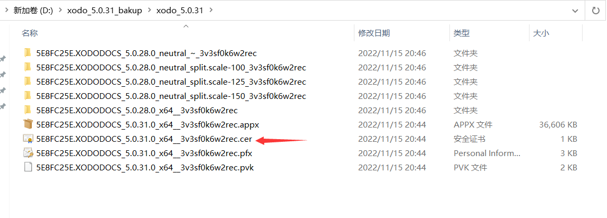

安装要选本地计算机：

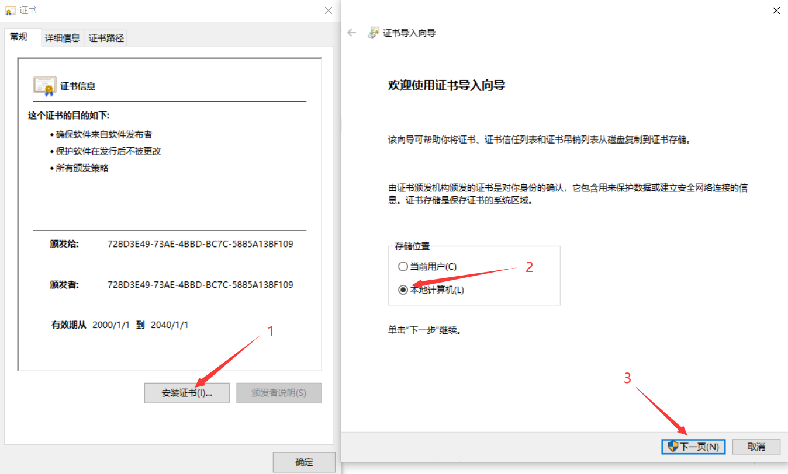

后面都默认就行

然后，双击安装第二个.pfx数字证书，一直默认选项安装就行

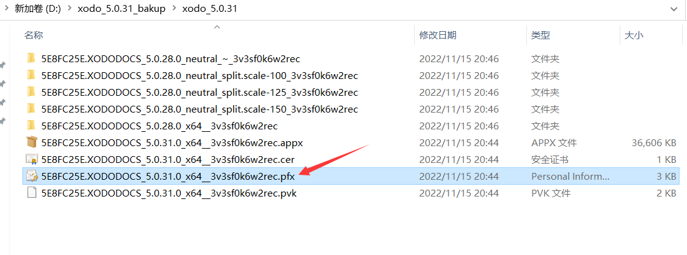

最后，双击安装.appx应用

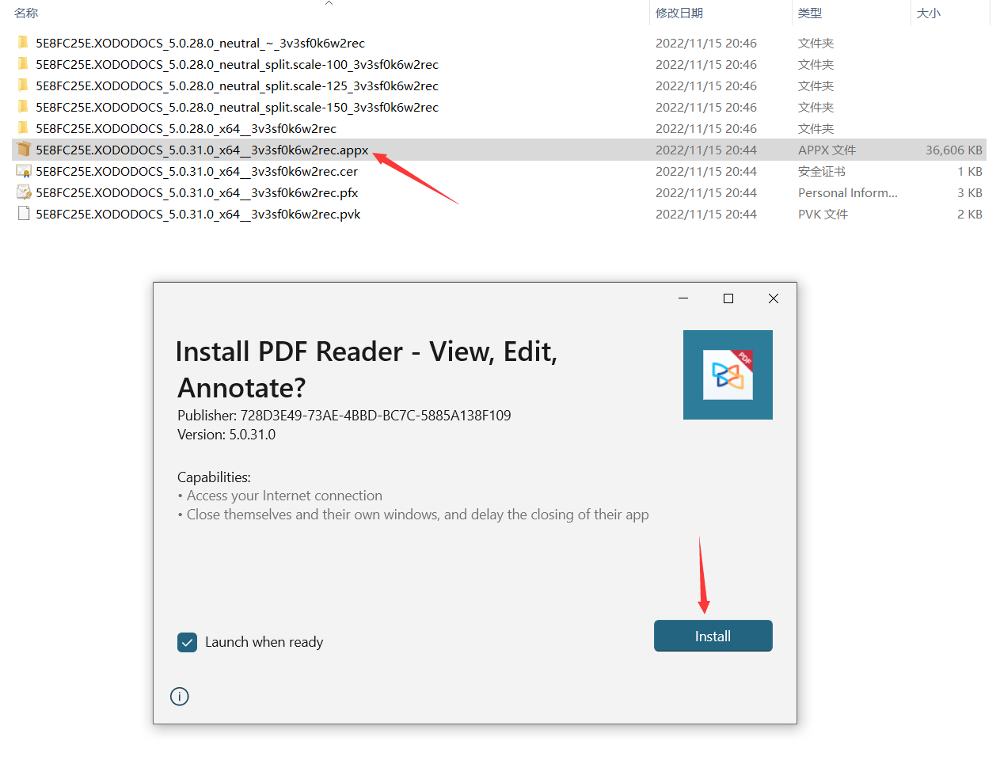

安装完毕后，在开始菜单栏就能看到，双击即可成功运行程序：

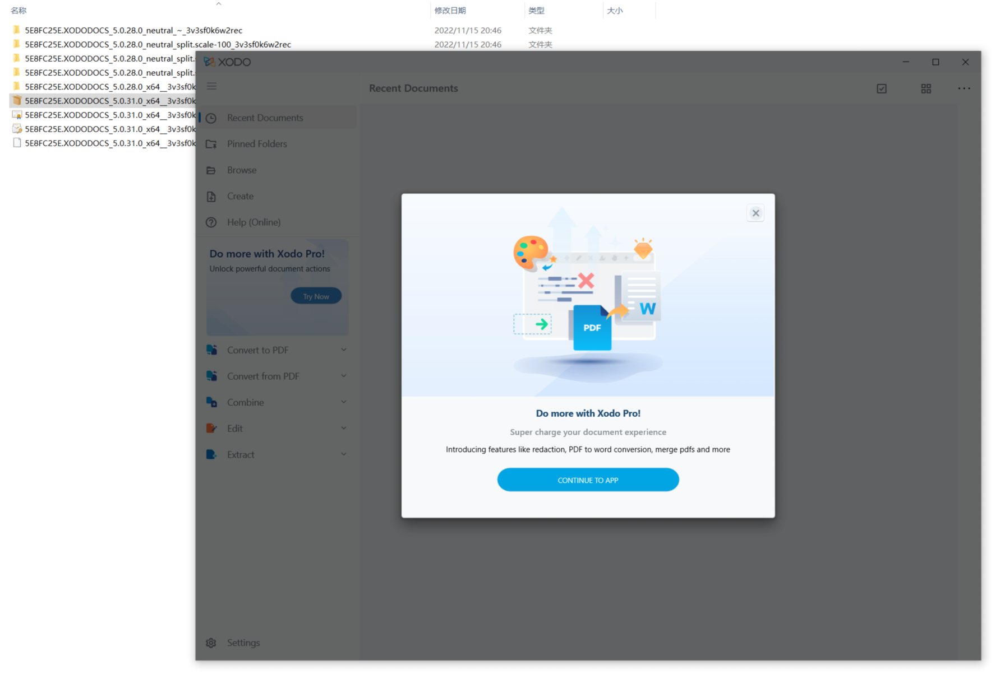

## 进一步了解

### 移动安装位置到其他盘

上面的安装教程，程序默认还是安装在

```
C:\Program Files\WindowsApps\5E8FC25E.XODODOCS_5.0.31.0_x64__3v3sf0k6w2rec
```

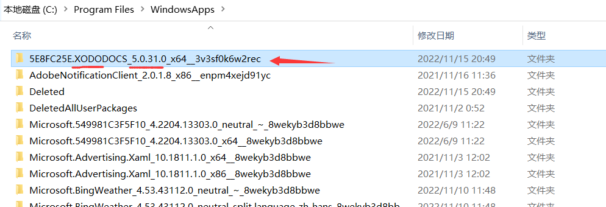

如果想移动到其他盘符，可以在应用和功能内操作

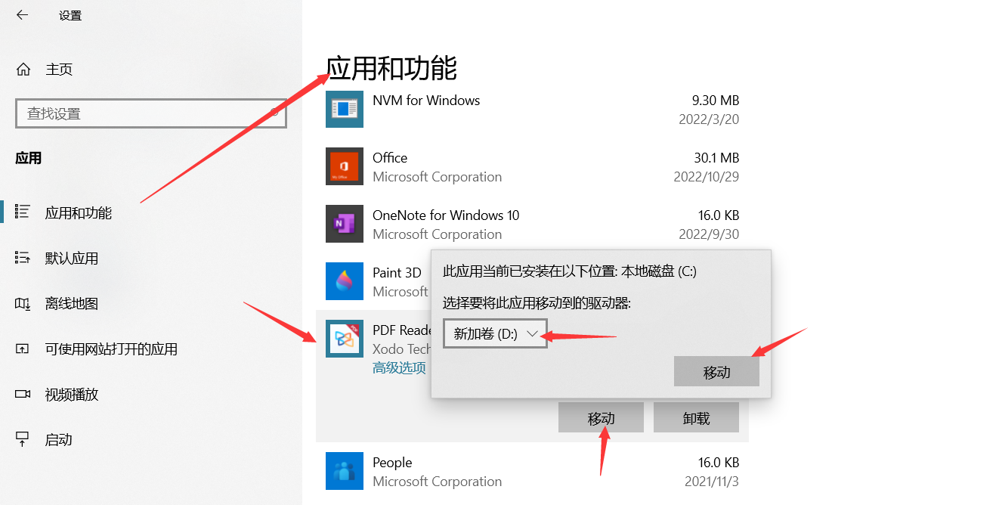

### UMP应用备份为安装包

win10应用商店的程序都是UMP应用，可以在运行时找到其目录，在

```
C:\Program Files\WindowsApps\XXXX
```

此目录权限复杂，改动十分不友好，复制某一个应用所在的文件目录到另一台电脑上，然后点击.exe运行，是不行的，总是提示缺少某些.dll文件，那么如何对UMP应用打包成安装呢？

使用WSAppBak工具，本目录提供了其压缩包，使用方式很简单，进入其目录，双击运行WSAppBak.exe：

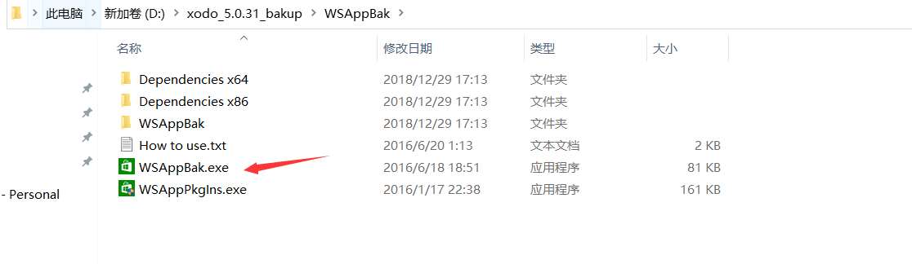

出现一个命令行，提示需要输入想备份应用的路径，那么找到想备份的UMP应用的目录，以本仓库刚刚安装的Xodo5.0.31为例，如下操作后，回车

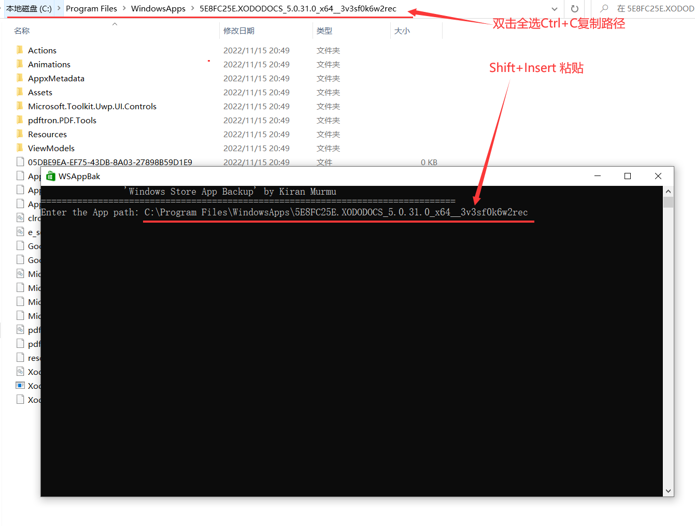

然后命令行提示需要输入一个输出目录，随便找一个盘创建一个新文件夹，以E盘新建的xodo文件夹为例，将这个文件夹的路径也复制粘贴进来后，回车：

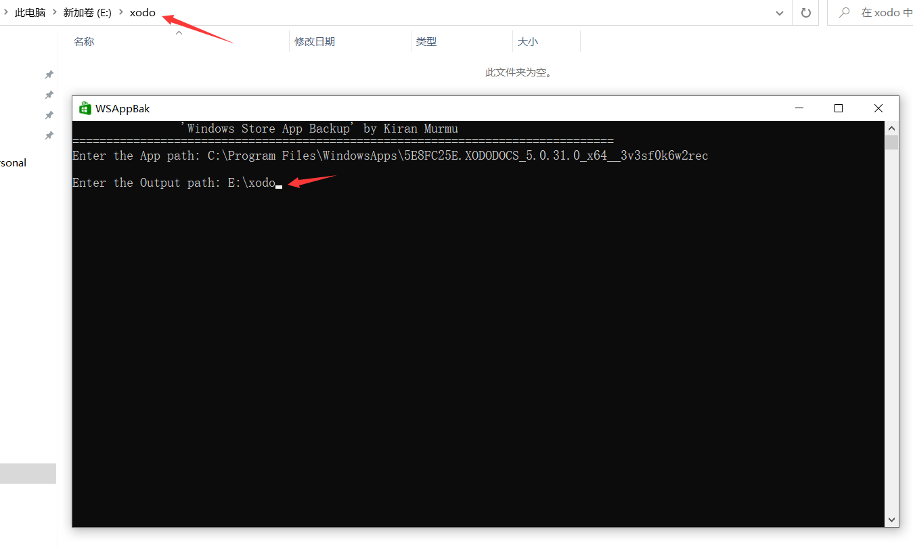

命令行出现很多字符，显示正在备份，等待备份完毕

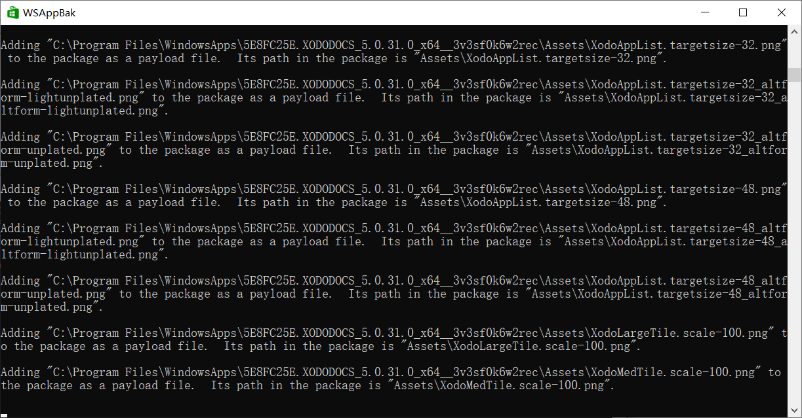

备份最后，会弹出可以设置密码啥的，如果用不上，选None即可

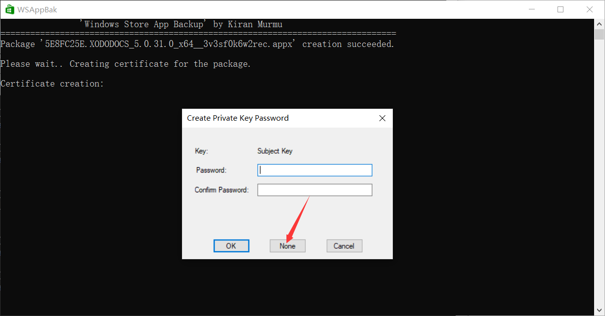

备份完毕后显示如下，可以关闭此命令窗口退出

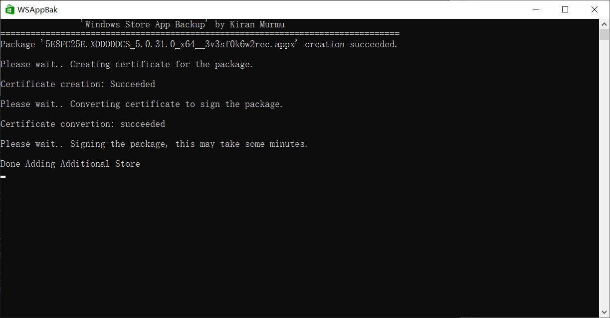

找到备份`E:\xodo`的目录，目录下既是与本仓库教程用到的文件一样

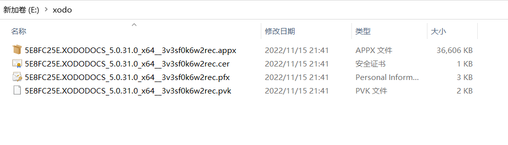

## 感谢

[轻松提取win10上的uwp应用为离线安装包！【软件专家原创】](https://www.bilibili.com/video/BV1UB4y1N7pz/?vd_source=e6ad3ca74f59d33bf575de5aa7ceb52e)

[WSAppBak](https://github.com/Wapitiii/WSAppBak)